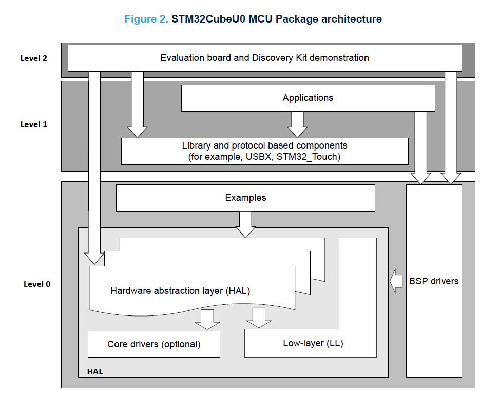

# Working with the NUCLEO-U083RC

## Getting Started

Follow the steps in the *STM32CubeIDE quick start guide* file to create your project using `STM32CubeIDE`. See the link below in the *Documents* section.

## Main Code Structure

| Folder/File | Description |
| :----: | :---------: |
| Core > Inc | Include `*.h` files |
| Core > Src | Source `*.c` files |
| Core > Startup | Assembly `*.s` file including STM32U083xx device vector table for GCC toolchain |
| Drivers > BSP | Board Support Package (BSP) files |
| Drivers > CMSIS | Cortex microcontroller software interface standard (CMSIS) files |
| Drivers > STM32U0xx_HAL_Driver | STM32U0 Hardware Abstraction Layer (HAL) files |
| `*.ioc` | MX-generated device configuration interface/file |

## STM32CubeU0 Package Architecgure

Fig. X. from UM3302.

## Documents

| Document | Description |
| :-----: | :------- |
| [UM2553](docs\pdfs\dm00598966-stm32cubeide-quick-start-guide-stmicroelectronics.pdf) | STM32CubeIDE quick start guide |
| [UM3256](docs\pdfs\um3256-stm32-nucleo64-boards-mb1932-stmicroelectronics.pdf) | Development board user manual |
| [UM3302](docs\pdfs\STM32CubeU0GettingStarted.pdf) | STM32CubeU0 package user manual|
| [AN6063](docs\pdfs\an6063-introduction-to-stm32cube-mcu-package-examples-for-stm32u0-mcus-stmicroelectronics.pdf) | STM32CubeU0 package examples |
| [UM3307](docs\pdfs\um3307-description-of-stm32u0-hal-and-lowlayer-drivers-stmicroelectronics.pdf) | Description of STM32U0 HAL and low-layer drivers |
| [RM0503](docs\pdfs\rm0503-stm32u0-series-advanced-armbased-32bit-mcus-stmicroelectronics.pdf) | Description of STM32U0 HAL and low-layer drivers |
| [STM32U083xC](docs\pdfs\stm32u083kc.pdf) | Datasheet of the STM32U083xC MCUs |
